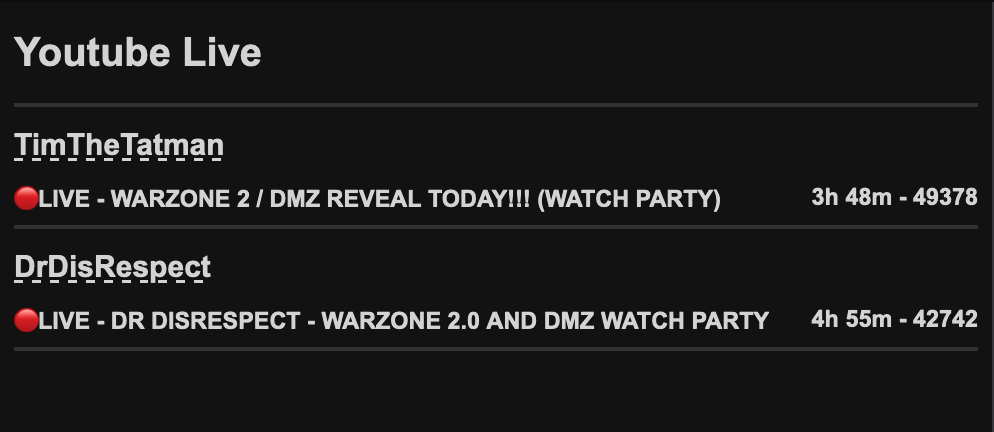

# youtube-live
Browser addon to show your favorite streamers on youtube that are currently live.

## Goal

The goal is to have a convenient way to see when your favorite youtube streamers are live, but doing so without cluttering your subsciption feed. 

## How

Currently the application works by getting the latest video for each channels 'uploads' playlist and checking to see if this video is a live broadcast.

The upload playlist can be found without making an api call if you have the users channel id;
If you replace 'UC' with 'UU' in the channel's id you have the channel's upload playlist id.

## Todo

- Auto refresh
- A way to add channels to follow (user config)
- A way to find the channel id by name or url
- Switch from API key to Auth (User sign-in, more quota)
- General styling
- Turn the web application into a browser add-on
- Find the current played game

## How to

- Rename config.template to config.js
- Fill in your api key (Youtube Data API) in config.js
- Enter the channel ids of the channels you want to follow in config.js
- Serve the src folder using your favorite hosting tool

## Screenshot

